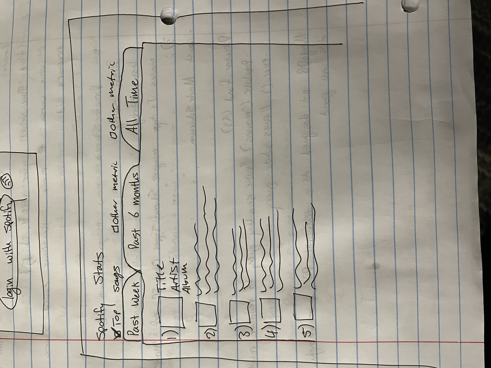
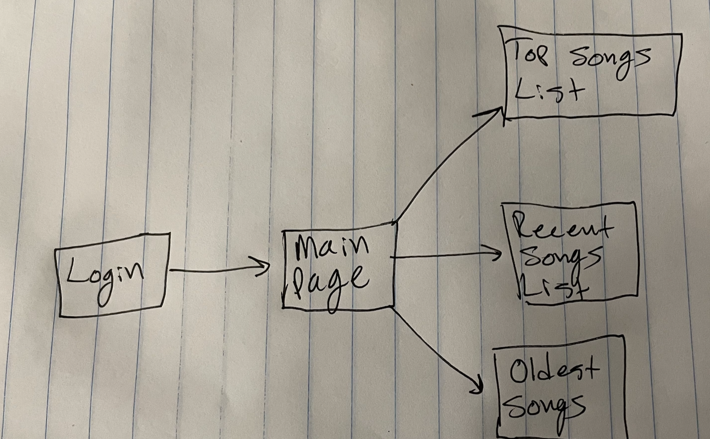

# Spotify Stats

## Overview

Everybody loves stats - especially when they're YOUR stats! That's why Spotify Stats will let you connect to your spotify account and display fun statistics about your listening habits. Do you wonder which song you've listened to the most in the last 6 months? Or maybe how many minutes of music you listen to in an average week? Spotify Stats will show you this information and more!

## Data Model

This application will use Spotify's API to retrieve data assosciated with a given account. With this data it will display lists of song objects. Each song object will contain title, artist, and album data fields as well as teh data supplied by spotify such as number of plays.


An Example User:

```javascript
{
  username: "spotify-user",
  hash: // a password hash,
  lists: // an array of references to List documents
}
```

An Example List with Embedded Items:

```javascript
{
  user: // a reference to a User object
  name: "Top Songs All Time",
  items: [
    { title: "Here Comes the Sun", artist: "The Beatles", plays: 145},
    { title: "Who Loves the Sun", artist: "The Velvet Underground", plays: 107},
  ],
}
```


## [Link to Commented First Draft Schema](db.mjs) 


## Wireframes

/login - Login page to connect to spotify account


/lists - Main page that shows music lists



## Site map

(__TODO__: draw out a site map that shows how pages are related to each other)




## User Stories or Use Cases

1. as non-registered user, I can login with my spotify account
2. as a user, I can decide which list I want to view
3. as a user, I can sort the list by time period (all time, month, week)
4. as a user, I can view statistics for a given list 

## Research Topics

* (5 points) Integrate Spotify API
  * Initial login by user
  * Importing data from spotify into my db
  * Manipulating this data to display sorted lists
* (3 points) Find and use a good CSS library
  * I want this site to look professional and have clean styling
  * I also want to learn how to implement outside libraries for CSS because my only experince 
  with CSS so far has always been tedious and never comes out looking particularly great


## [Link to Initial Main Project File](app.mjs) 

## Annotations / References Used

(__TODO__: list any tutorials/references/etc. that you've based your code off of)

