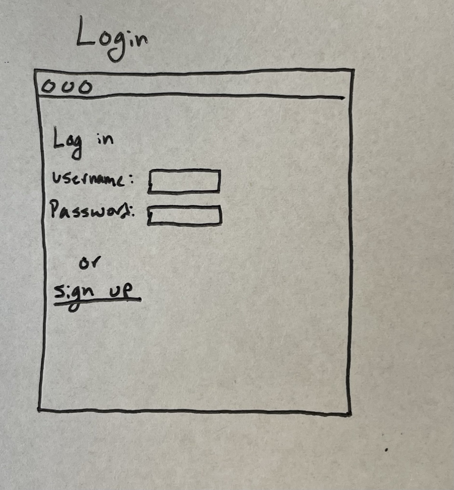

# Image Collector

## Overview

Your one stop to store and organize images you find on the web! Sort images into folders based on whatever criteria you want. Maybe you'd like to create a folder of images for your desktop background that you've found online, or cute pictures of cats that you don't want to lose. Whatever it may be, this web app will allow you to store all these images in a clean and organized fashion.

## Data Model

This application will be mainly made up of folders and images. Each folder contains a title and an array of image objects, and each image object contains a link to the image and an optional caption.

An Example Folder:

```javascript
{
  title: 'cute-cats',
  description: 'This is a folder for storing images of cute cats',
  images: [{url: 'example.jpg', caption: 'OMG'}, {etc...}, {etc...}]
}
```

An Example Image:

```javascript
{
  url: 'example.jpg',
  caption: 'OMG'
}
```


## [Link to Commented First Draft Schema](db.mjs) 


## Wireframes

/login - Login page

    

/home - Home page shows all folders

   

/folder/:slug - The contents of a folder

   

## Site map

      


## User Stories or Use Cases

1. As a non-registered user I can register and set a username/password
2. As a user I can create a new folder if one doesn't already exist
3. As a user I can examine the contents of an existing folder
4. As a user I can add and remove images to/from a folder
5. As a user I can add captions to images and a description to folders

## Research Topics

* (2 points) Use SASS for CSS (might change to PostCSS to be more easily compatible with Tailwind)
  * Working with CSS is usually pretty painful. I'd like to learn to use SASS to make the preprocessing a smoother and 
  * More efficient process
* (2 points) Tailwind as a CSS library
  * See above, I'd like to explore options for creating aesthetically pleasing sites using external frameworks
* (3 points) Client-side form validation
  * My project will rely on forms for users to upload their images. I'd like to validate that the tings they are uploading will work properly when rendered.
* (3 points) Use vite or webpack to automate Sass
  * This should make my code more concise by bundling assets like images and scripts.

## [Link to Initial Main Project File](app.mjs) 

## Annotations / References Used

(__TODO__: list any tutorials/references/etc. that you've based your code off of)